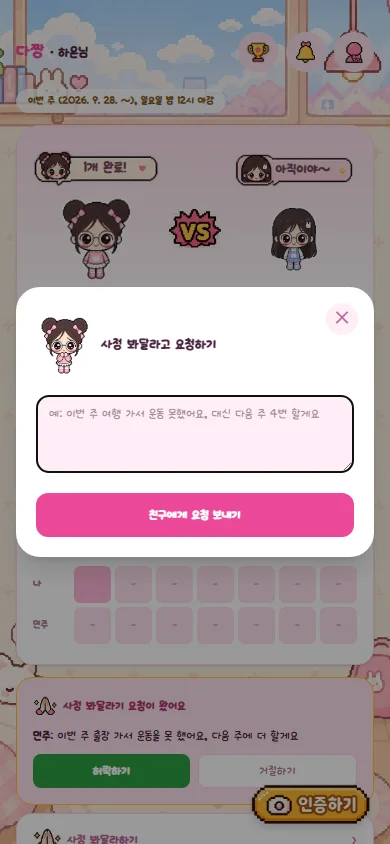
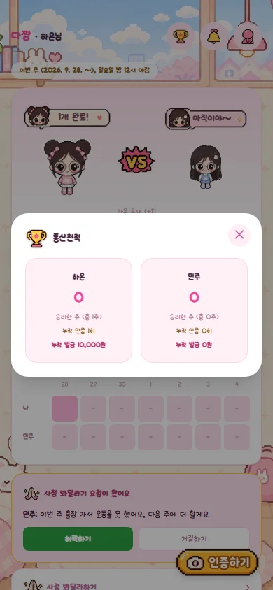

# 다짱

친구랑 1:1로 운동 인증 맞짱 뜨는 개인용 웹앱(PWA). 방 코드 하나로 친구를 초대하고, 주 3회 인증 못 하면 벌금.

<p align="center">
  
  
  
  
</p>

## 규칙

- 방(Room) 하나 = 1:1 맞짱. 방을 만들면 6자리 방 코드가 나오고, 친구가 그 코드로 들어와 닉네임을 정하면 둘이 매칭됨
- 친구가 여러 명이면 그만큼 방을 여러 개 만들 수 있음 (각 방은 완전히 독립적으로 인증/벌금 관리)
- 주 3회 인증샷 업로드 (self-report, 타이머 없음), **하루 1장만 인정** — 같은 날 다시 올리면 이전 사진은 자동으로 교체됨
- 매주 월요일 00:00 ~ 일요일 23:59 (KST)이 한 주. **마감 지나면 그 주에 사진 추가 불가 (소급 불가)**
- 마감 시점 기준 3회 미만이면 부족한 횟수 x 벌금
- **사정 봐달라기**: 부족한 날에 대해 사유 적어서 요청 → 상대방이 허락하면 인증 1회로 인정돼서 벌금 차감. 결과(허락/거절)는 상대방이 다음에 앱 열 때 팝업으로 알려줌
- **쉬어가기 / 방 삭제**: 둘 다 상호 동의 방식 — 한쪽이 요청하면 상대방이 수락해야 실제로 적용됨 (여행 등으로 몇 주 쉬거나, 그만두고 싶을 때)
- 인증샷은 업로드 전 브라우저에서 자동으로 리사이즈/압축되고, 30일이 지나면 사진만 자동 삭제됨 (인증 횟수 기록은 그대로 유지)

## 기능

| | |
|---|---|
| 방 코드로 시작 | 링크 없이 6자리 코드만 알아도 참여 가능. |
| 대결 카드 | 이번 주 인증 횟수를 캐릭터 배틀 형태로 보여줌 (많이 한 쪽이 커짐) |
| 사정 봐달라기 | 요청 → 허락/거절 → 결과 팝업까지 완결된 흐름 |
| 모임 통장 | 벌금 보낼 공용 계좌 하나만 등록해두면 홈 화면에서 바로 계좌번호 복사 / 은행 앱 열기 |
| 통산전적 | 누적 인증 횟수, 승리한 주, 누적 벌금을 한눈에 |
| 지난 기록 | 주차별 결과 확인하고 정산완료 체크 |
| 쉬어가기 / 방 삭제 | 상호 동의 방식으로 일시정지하거나 방 자체를 삭제 |
| 웹 푸시 알림 | 남은 날 안에 채우려면 매일 해야 하는 시점부터 리마인드, 결과 확정(월요일) 알림 |

## 기술 스택

- [Next.js 16](https://nextjs.org) (App Router, Turbopack), React 19, TypeScript
- [Prisma](https://www.prisma.io) + PostgreSQL ([Neon](https://neon.com))
- Tailwind CSS v4
- [web-push](https://github.com/web-push-libs/web-push) (VAPID 기반 웹 푸시)
- PWA (manifest + service worker), Vercel Cron

## 로컬 개발

1. 의존성 설치
   ```bash
   npm install
   ```
2. `.env` 채우기
   - `DATABASE_URL`: Postgres 연결 문자열 ([neon.com](https://neon.com)에서 무료로 만들 수 있음)
   - `SESSION_SECRET`, `CRON_SECRET`은 아무 랜덤 문자열로 변경
   - 웹푸시 키 생성:
     ```bash
     npx web-push generate-vapid-keys
     ```
     나온 public/private key를 `VAPID_PUBLIC_KEY`, `VAPID_PRIVATE_KEY`, `NEXT_PUBLIC_VAPID_PUBLIC_KEY`(=public key와 동일값)에 채워넣기
3. DB 마이그레이션 적용
   ```bash
   npx prisma migrate dev --name init
   ```
4. 로컬 실행
   ```bash
   npm run dev
   ```
5. `http://localhost:3000` 접속 → "방 만들기" → 닉네임 정하기 → 나오는 방 코드를 친구에게 전달

## 사용법

1. 앱 접속 → "방 만들기" → 나온 방 코드 확인
2. "초대 공유하기"로 친구에게 코드 전달 (카톡 등), 혹은 친구가 홈 화면에서 코드를 직접 입력
3. 친구가 코드로 입장 → 닉네임 정하고 참여
4. 각자 알림 종 아이콘으로 푸시 허용
5. 운동 후 우측 하단 "인증하기"로 사진 업로드
6. "지난 기록"에서 주차별 결과 확인, 벌금 낸 사람은 본인이 직접 "정산완료" 체크
7. 여러 친구랑 하고 싶으면 내 정보에서 로그아웃 후 새 방을 또 만들면 됨
